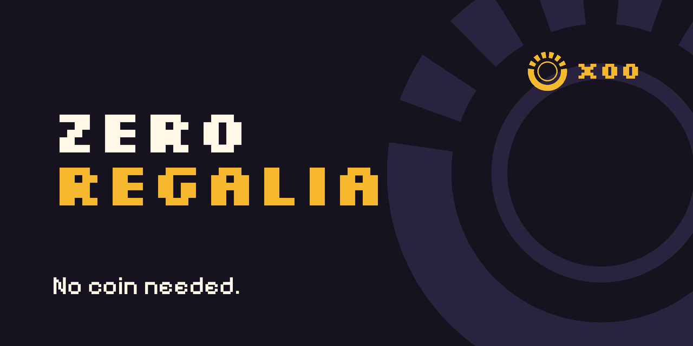
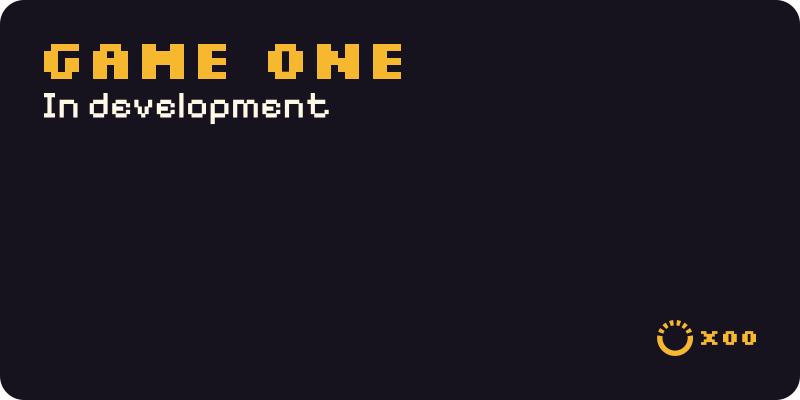
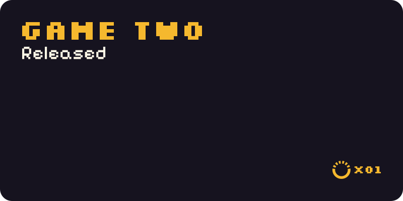

  

  <picture>
    <source media="(prefers-color-scheme: dark)" srcset="assets/lockup-dark.svg">
    
  </picture>

<h3 align="center">No coin needed.</h3>

<table><tr>
<td width="50%"></td>
<td width="50%"></td>
</tr></table>

Counters tick per release. x00 means it isn't out yet.

